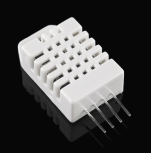

# DHT22 Sensor Driver (Bare-metal C)

This folder contains a **bare-metal C driver for the DHT22 (AM2302) temperature and humidity sensor**, developed for embedded systems without using HAL or high-level libraries.

The driver is designed with a **low-level, timing-critical approach**, suitable for microcontrollers where precise GPIO control and microsecond delays are required.

---

## Features

- Temperature and humidity measurement
- Single-wire (1-Wire–like) protocol implementation
- Accurate timing control using microsecond delays
- Checksum validation
- Clear API separation (init / read / low-level bit handling)

---

## Supported Platforms

- EFR32 (Silicon Labs)
- Easily portable to STM32 or other MCUs

---

## Hardware Interface

- Data pin: Single GPIO (open-drain recommended)
- External pull-up resistor (4.7kΩ – 10kΩ)
- Operating voltage: 3.3V / 5V

---
## Image of DHT22

